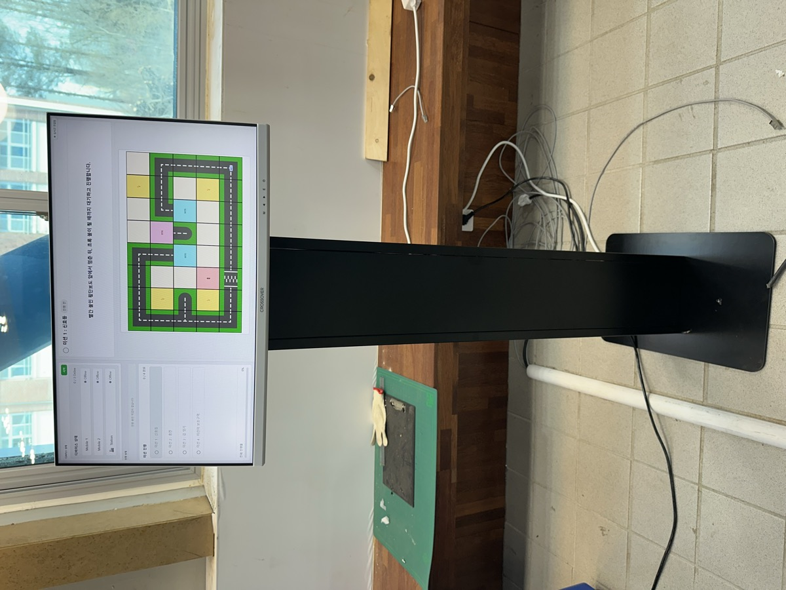
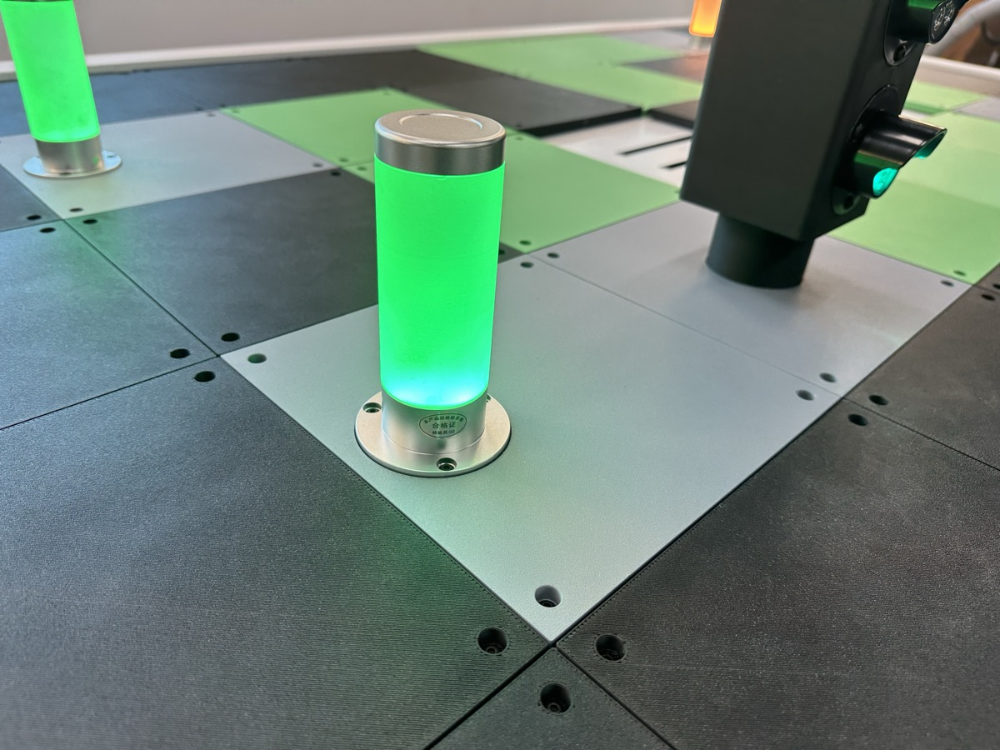
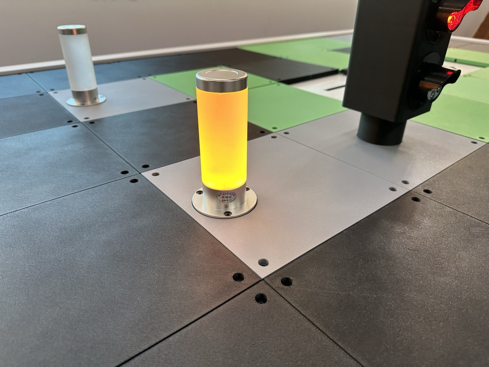
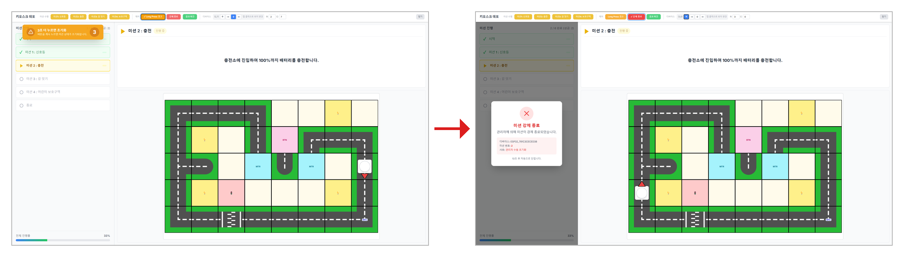
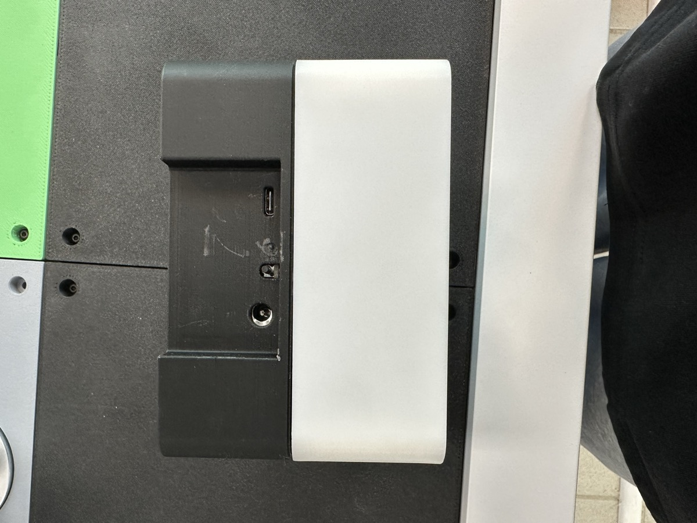
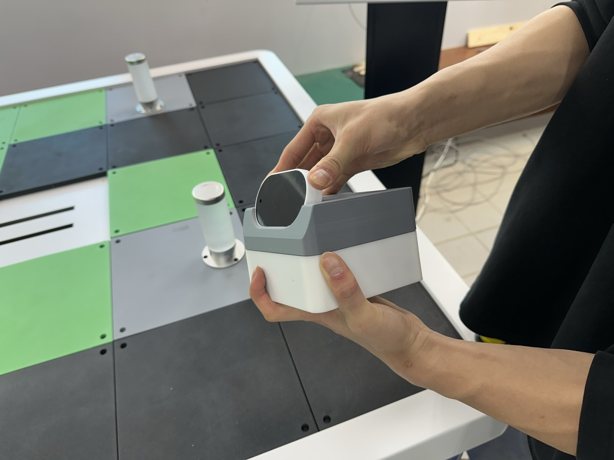
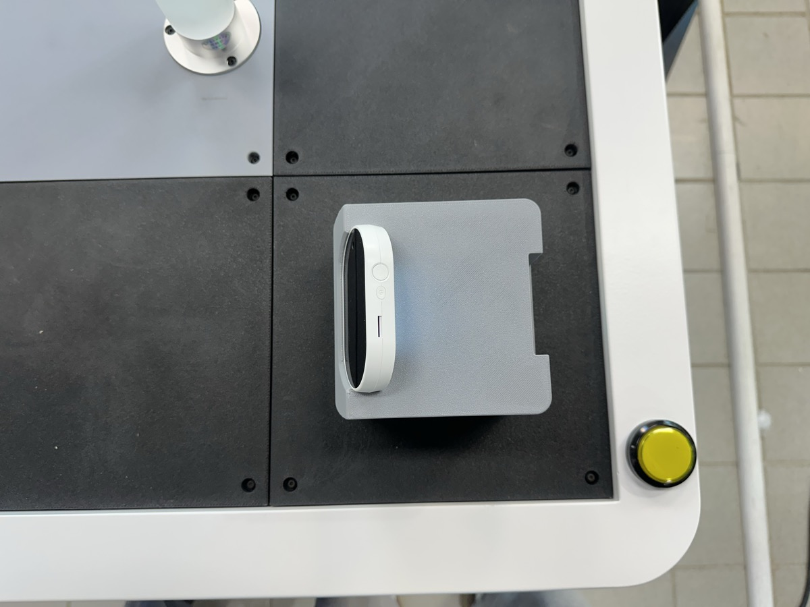
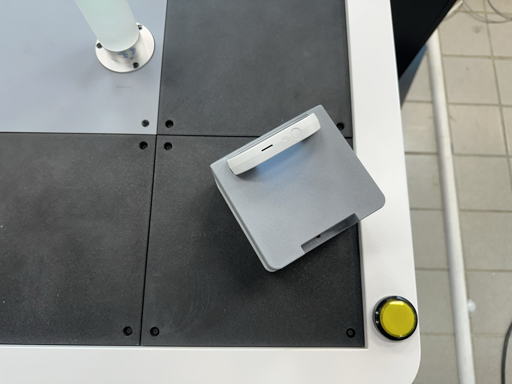
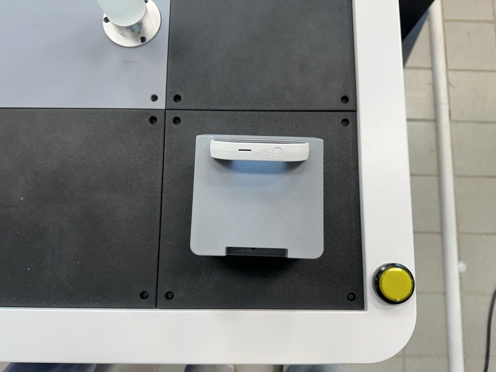
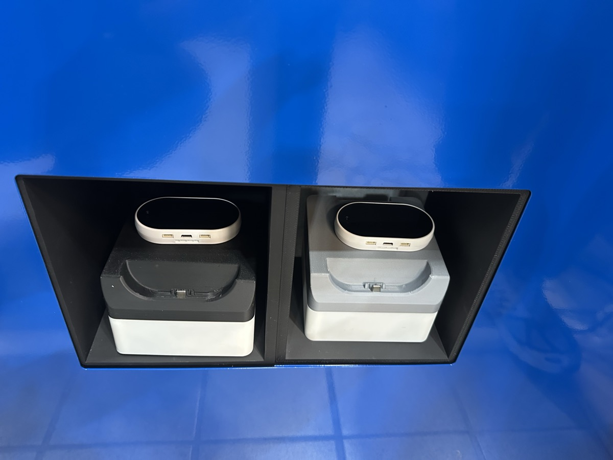

# 은평구 스마트 시티

## 스마트 시티란?

학생들이 <mark style="background-color:purple;">**직접 코딩한 명령에 따라 모바일 로봇이 도시 위를 주행**</mark>하며 다양한 미션을 수행하는 교육용 스마트 시티입니다.

모바일 로봇에 장착된 AI 카메라를 활용하여 신호등을 인식하고, 사용자가 작성한 코드에 따라 자율적으로 움직이며 미션을 완수합니다. 미션의 성공 여부는 미션 렘프의 색상을 통해 즉각적으로 확인할 수 있어, 코딩과 로봇 제어의 결과를 바로 학습할 수 있도록 설계되었습니다.

<figure><figcaption>
<strong>SMART CITY(스마트 시티)</strong>
</figcaption></figure>

## 스마트 시티 스펙

### 하드웨어 구성

**시티**

* 모바일 로봇 X 2대 (AI 카메라 X 2대)
* 미션 렘프 X 4개
* 신호등 X 1개
* 스테이션 디바이스 X 1개
* 리니어 벨트 X 1개
* 와이파이 공유기 X 1개

**키오스크**

* 터치 모니터 X 1개
* 미니 PC X 1개

> 크기

<figure><figcaption></figcaption></figure>


**소프트웨어 업데이트 안내**

스마트 시티는 인터넷이 연결되어 있으면 자동으로 소프트웨어를 업데이트합니다.


## 초기 세팅

> 초기 위치 세팅

1. 전원이 꺼진 상태에서 리니어 벨트를 신호등 쪽으로 밀어놓습니다.
2. 전원 연결 시 미션 렘프 및 신호등이 잠시 깜빡입니다. 깜빡임이 끝나면 정상 작동 상태입니다.


리니어 벨트 초기 위치 세팅 방법



**주의사항**

스마트 시티의 초기 세팅은 반드시 전원이 꺼진 상태에서 설정해야 합니다. 전원이 켜진 상태에서 리니어 벨트를 이동시키면 고장의 원인이 될 수 있으니 주의하십시오.



**리니어 벨트 문제 발생 시**

1. 전원을 분리합니다.
2. 30초 정도 기다립니다.
3. 리니어 벨트를 **초기 세팅 위치**(신호등 쪽)로 밀어놓습니다.
4. 전원을 다시 연결합니다.


> (스마트 시티)전원 연결시 초기 위치로 이동

스마트 시티는 전원을 연결하면, 스마트 시티의 리니어 벨트가 자동으로 초기 위치로 이동합니다. 이 과정은 약 1분정도 소요됩니다.




> (키오스크) 전원 연결시 앱 자동 실행

키오스크의 전원을 연결하면, 자동으로 키오스크에서 앱이 자동으로 실행 됩니다.이 과정은 약 2분정도 소요됩니다.




> 맵 색상 안내

<figure><figcaption>
스마트 시티 맵 구성
</figcaption></figure>

* <mark style="background-color:purple;">**검은색**</mark> — 도로 (모바일 로봇 주행 구간)
* <mark style="background-color:purple;">**회색**</mark> — 모듈이 올라가는 자리
* <mark style="background-color:purple;">**녹색**</mark> — 차도 아님 (주행 불가 구간)

### 소프트웨어 환경

스마트 시티의 소프트웨어는 \*\*키오스크(터치 모니터)\*\*를 통해 조작합니다.

<figure><figcaption>
키오스크 소프트웨어 화면
</figcaption></figure>

*   **터치 모니터**

    학생이 직접 코딩한 명령을 기반으로 모바일 로봇의 미션 수행 과정을 단계별로 확인할 수 있는 소프트웨어입니다. 미션 제어 및 설정 기능을 제공하며, 모바일 로봇의 주행 상태와 미션 진행 상황을 실시간으로 확인할 수 있어 코딩 결과를 즉각적으로 학습할 수 있도록 설계되었습니다.

## 미션 렘프

미션 렘프는 미션의 진행 상태를 색상으로 표시합니다.

* <mark style="color:green;">**초록**</mark> — 미션 성공
* <mark style="color:orange;">**주황**</mark> — 미션 실행 중
* <mark style="color:red;">**빨강**</mark> — 미션 실패

<figure><figcaption>
미션 성공 시 초록색으로 점등
</figcaption></figure> <figure><figcaption>
미션 실행 중 주황색으로 깜빡
</figcaption></figure> <figure><figcaption>
미션 실패 시 빨간색으로 점등
</figcaption></figure>

## 스마트 시티 전원 조작

* **시작** — 스마트 시티의 버튼을 **한 번** 누릅니다.
* **강제 종료** — 스마트 시티의 버튼을 **5초 이상** 길게 누릅니다.

<figure><figcaption></figcaption></figure>

<figure><figcaption></figcaption></figure>



## 모바일 로봇

모바일 로봇은 사용자가 코딩한 명령에 따라 스마트 시티의 도로 위를 주행합니다.

### 모바일 로봇 구성 요소

<figure><figcaption>
충전 단자, 리셋 버튼, C타입 단자 위치
</figcaption></figure>

* **충전 단자** — 충전 도크에 거치하여 충전
* **리셋 버튼** — 와이파이 연결 확인 용도 (깜빡임이 끝나면 연결 완료)
* **C타입 단자** — 개발자용

### 모바일 로봇 와이파이 연결 (최초)

1. 모바일 로봇의 **리셋 버튼**을 누릅니다.
2. 인디케이터의 **빛이 깜빡거리는 것**을 확인합니다.
3. 깜빡거림이 끝나고 **빛이 켜지면** 와이파이 연결이 완료된 것입니다.
4. 이후 AI카메라를 장착합니다.



### AI 카메라 장착

<figure><figcaption>
AI 카메라 장착 방법
</figcaption></figure> <figure><figcaption>
Ai 카메라가 장착된 모습
</figcaption></figure>


**주의사항**

카메라를 끼울 때 반드시 **꽉 끼워주세요.** 대부분의 문제가 카메라가 제대로 장착되지 않아서 발생합니다. 사용 후에는 카메라를 빼서 보관해 주세요.


### 모바일 로봇 방향

모바일 로봇을 도로 위에 올려놓을 때, 반드시 <mark style="background-color:purple;">**카메라가 왼쪽을 향하도록**</mark> 똑바르게 놓아야 합니다.


타일 뒷면에 NFC와 자석이 있어서 정확하게 인식 시켜야 모바일 로봇이 움직입니다.


> 올바른 방향

<figure><figcaption>
올바른 방향 — 카메라가 왼쪽을 향하도록 똑바르게 놓아주세요
</figcaption></figure>

> 잘못된 방향


**주의사항**

아래와 같이 로봇을 삐뚤하게 놓으면 정상적으로 동작하지 않습니다. 반드시 카메라가 왼쪽을 향하도록 똑바르게 놓아주세요.


<figure><figcaption>
X — 잘못된 방향 (로봇이 삐뚤하게 놓여 있음)
</figcaption></figure>

<figure><figcaption>
X — 잘못된 방향 (카메라가 올바른 방향을 향하지 않음)
</figcaption></figure>

### 미션 재실행

똑같은 미션을 한 번 더 실행하고 싶을 경우, AI 카메라의 **전원 버튼을 눌러 초기화**해 주어야 합니다. 초기화 없이 재실행하면 정상적으로 동작하지 않을 수 있습니다.

<figure><figcaption></figcaption></figure>

### 충전

<figure><figcaption>
모바일 로봇 2대가 충전 도크에 거치된 모습
</figcaption></figure>


**주의사항**

충전 시 반드시 **AI 카메라를 분리한 후** 충전해 주세요. 카메라를 장착한 채로 충전하면 **발열**이 발생할 수 있습니다.


## 사용법


**사용 전 확인사항**

* AI 카메라가 모바일 로봇에 **꽉 끼워져** 있는지 확인
* 리니어 벨트가 **신호등 쪽으로 밀려있는지** 확인

