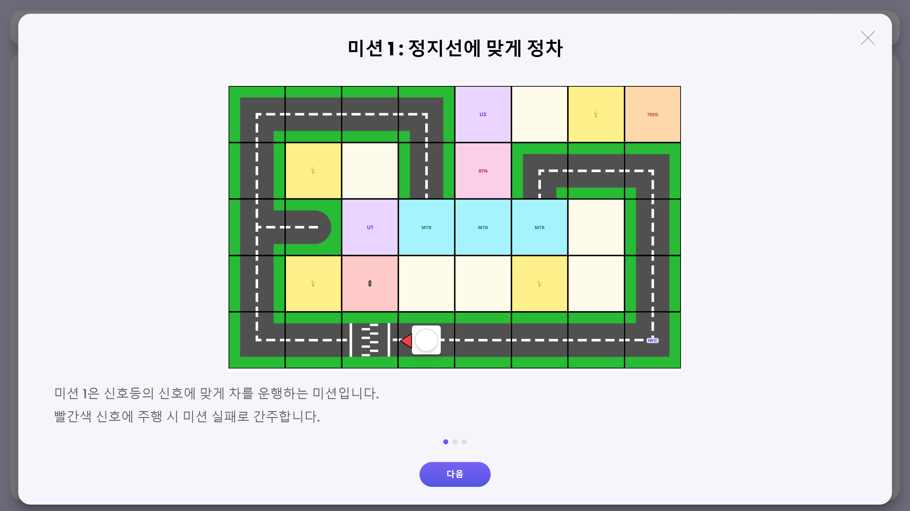
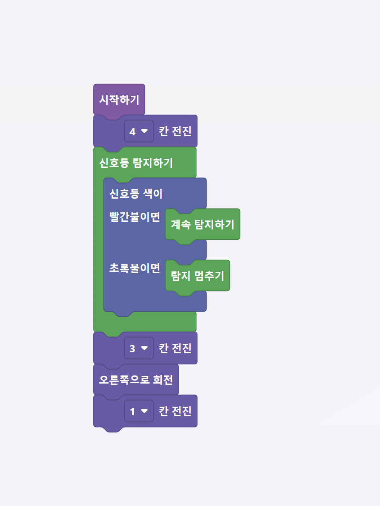
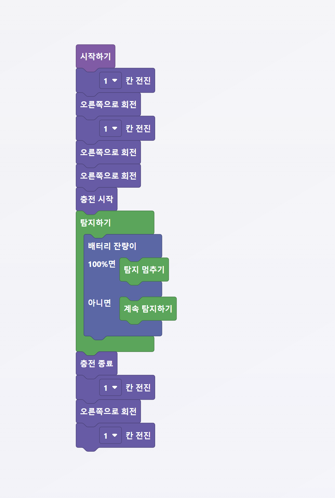
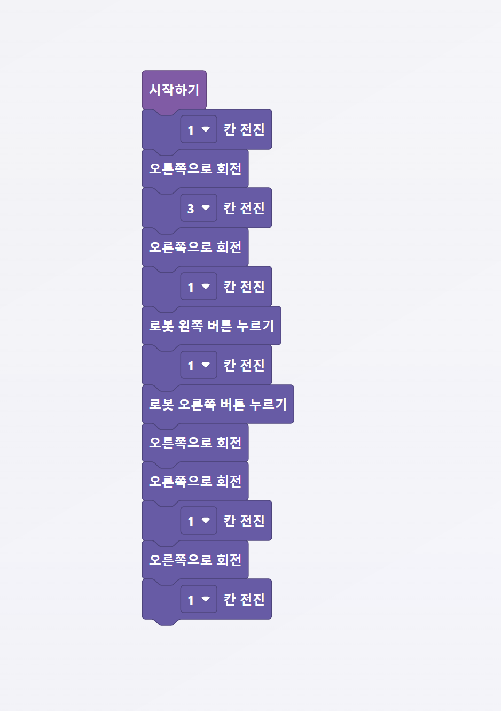
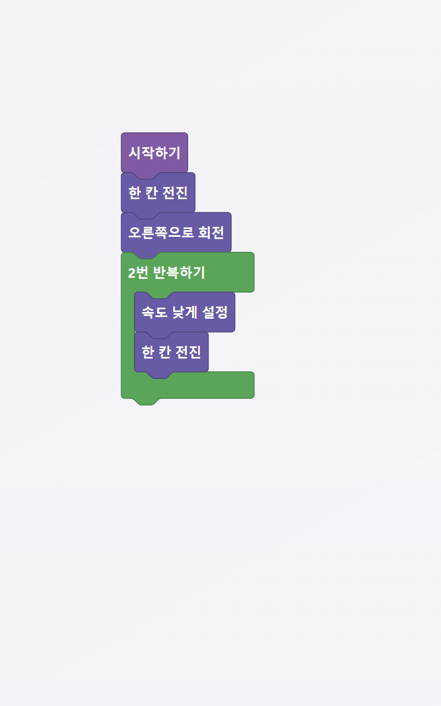

# 미션 안내 & 블럭 설명

스마트 시티에는 총 **4개의 미션**이 있습니다. 미션은 순서대로 진행되며, 각 미션을 성공적으로 완료해야 다음 미션으로 넘어갑니다.


반드시 코딩은 **시작하기 블럭 아래**에 붙여야 동작 합니다.


***

## 미션 1 : 신호등

미션 1은 신호등의 신호에 맞게 차를 운행하는 미션입니다.

빨간색 신호에 주행 시 미션 실패로 간주합니다.

<figure><figcaption>
미션 1 — 미션 설명
</figcaption></figure>

***

### 블럭 설명

<figure><figcaption></figcaption></figure>

* **시작하기** — 코드 실행을 시작합니다.

<figure><figcaption></figcaption></figure>

* **모바일 로봇** — 모바일 로봇의 움직임을 선택할 수 있습니다. 전진, 오른쪽/왼쪽 회전을 선택할 수 있습니다.

<figure><figcaption></figcaption></figure>

* **조건 블럭** — 탐지 블럭 안에서만 사용할 수 있습니다. 신호등 탐지 결과에 따른 선택을 할 수 있습니다.

<figure><figcaption></figcaption></figure>

* **탐지 블럭** — 신호등을 반복 탐지하는 블럭입니다. 탐지 멈추기를 통해 탐지를 그만둘 수 있습니다.

***

### 정답 코드&#x20;

<figure><figcaption>
미션 1 — 정답 코드
</figcaption></figure>

***

## 미션 2 : 충전

미션 2는 충전소에 들러, 충전 이후 주행을 이어나가야 합니다.&#x20;

충전소에서 왼쪽 방향을 보지 않으면 충전 실패가 됩니다.

<figure><figcaption></figcaption></figure>

***

### 블럭 설명

<figure><figcaption></figcaption></figure>

* **시작하기** — 코드 실행을 시작합니다.

<figure><figcaption></figcaption></figure>

* **모바일 로봇** — 모바일 로봇의 움직임을 선택할 수 있습니다. 전진, 오른쪽/왼쪽 회전을 선택할 수 있습니다.

<figure><figcaption></figcaption></figure>

* **충전** — 모바일 로봇을 정해진 위치에서 충전시킬 수 있습니다. 충전 시작과 종료를 선택할 수 있습니다.

<figure><figcaption></figcaption></figure>

* **조건 블럭** — 탐지 블럭 안에서만 사용할 수 있습니다. 배터리 잔량 탐지 결과에 따른 선택을 할 수 있습니다.

<figure><figcaption></figcaption></figure>

* **탐지 블럭** — 배터리의 잔량을 탐지하는 블럭입니다. 탐지 멈추기를 통해 탐지를 그만둘 수 있습니다.

***

### 정답 코드&#x20;

<figure><figcaption>
미션 2 — 키오스크 화면
</figcaption></figure>

***

## 미션 3 : 길 잇기

미션 3은 로봇의 도움으로 끊어진 길을 연결하여 다음 지점까지 이동해야 합니다.

<figure><figcaption></figcaption></figure>

***

### 블럭 설명

<figure><figcaption></figcaption></figure>

* **시작하기** — 코드 실행을 시작합니다.

<figure><figcaption></figcaption></figure>

* **모바일 로봇** — 모바일 로봇의 움직임을 선택할 수 있습니다. 전진, 오른쪽/왼쪽 회전을 선택할 수 있습니다.

<figure><figcaption></figcaption></figure>

* **오른쪽 버튼 누르기 및 왼쪽 버튼 누르기** — 각 방향에 맞게 리니어 벨트의 위치가 이동합니다.

***

### 정답 코드&#x20;

<figure><figcaption>
미션 3 — 키오스크 화면
</figcaption></figure>

***

## 미션 4 : 어린이 보호구역

미션 4는 속도 제한구역에서 속도를 낮추어 주행해야 합니다.

<figure><figcaption></figcaption></figure>

***

### 블럭 설명

<figure><figcaption></figcaption></figure>

* **시작하기** — 코드 실행을 시작합니다.

<figure><figcaption></figcaption></figure>

* **모바일 로봇** — 모바일 로봇의 움직임을 선택할 수 있습니다. 전진, 오른쪽/왼쪽 회전을 선택할 수 있습니다.

<figure><figcaption></figcaption></figure>

* **2번 반복하기** — 이 블럭 내에 있는 동작을 한번 더 실행합니다.

***

### 정답 코드

<figure><figcaption>
미션 4 — 키오스크 화면
</figcaption></figure>

***

## 미션 수행 영상


