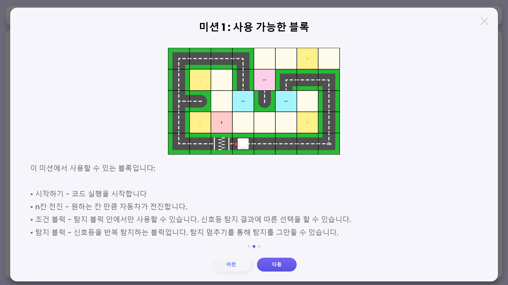
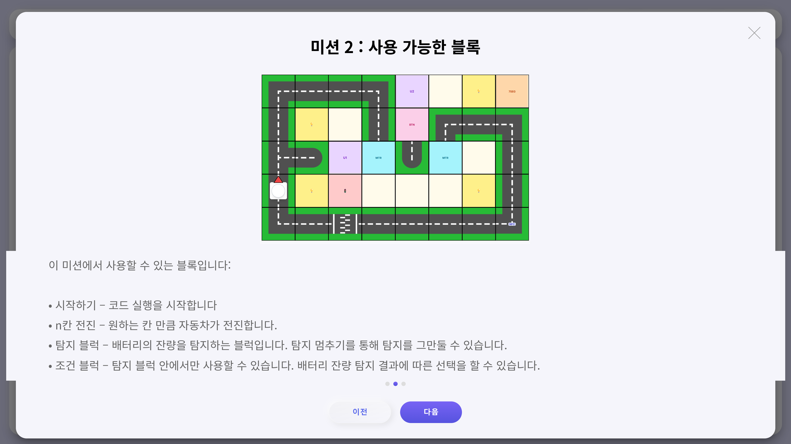
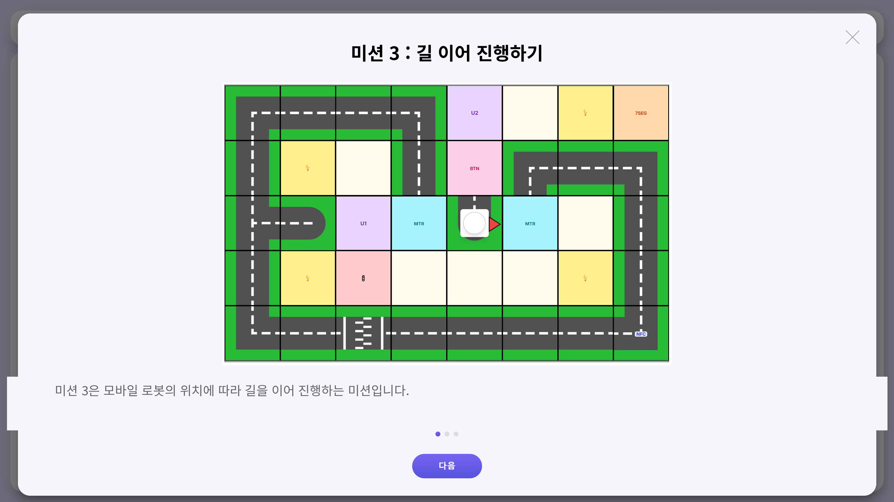
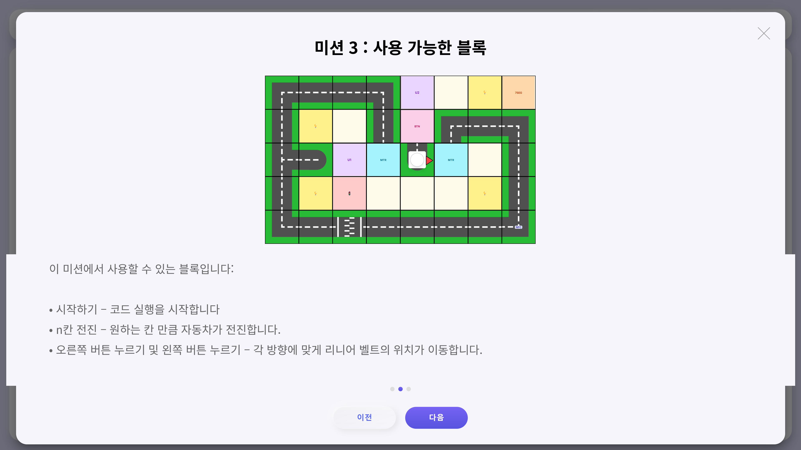
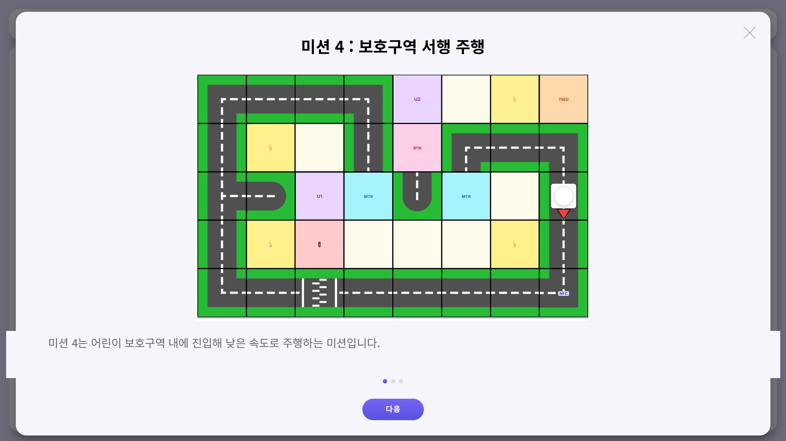
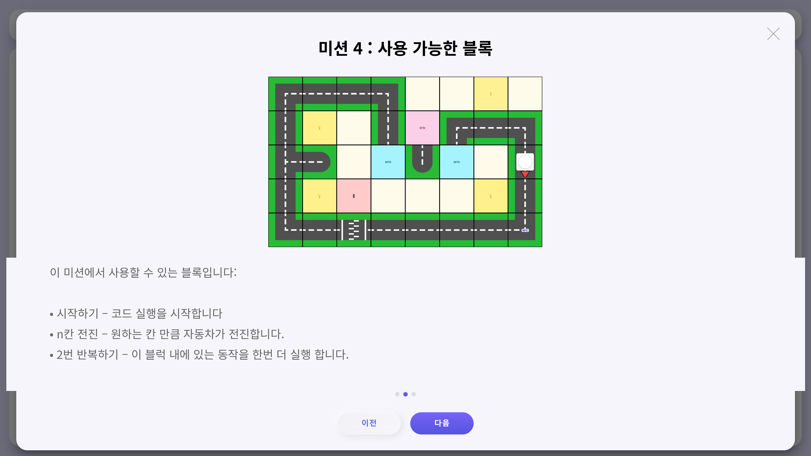

# 미션 안내 & 블록코딩 사용법

스마트 시티에는 총 **4개의 미션**이 있습니다. 미션은 순서대로 진행되며, 각 미션을 성공적으로 완료해야 다음 미션으로 넘어갑니다.

블록코딩은 키오스크 화면을 터치하며 진행합니다.

***

## 미션 1 : 신호등

미션 1은 신호등의 신호에 맞게 차를 운행하는 미션입니다.

빨간색 신호에 주행 시 미션 실패로 간주합니다.

<figure><figcaption>
미션 1 — 미션 설명
</figcaption></figure> <figure><figcaption>
미션 1 — 블록 구성
</figcaption></figure>

<figure><figcaption>
미션 1 — 키오스크 화면
</figcaption></figure>

***

### 블록 설명

* **시작하기** — 코드 실행을 시작합니다.
* **n칸 전진** — 원하는 칸 만큼 자동차가 전진합니다.
* **조건 블럭** — 탐지 블럭 안에서만 사용할 수 있습니다. 신호등 탐지 결과에 따른 선택을 할 수 있습니다.
* **탐지 블럭** — 신호등을 반복 탐지하는 블럭입니다. 탐지 멈추기를 통해 탐지를 그만둘 수 있습니다.

***

## 미션 2 : 충전

미션 2는 충전소에 진입하여 100%까지 배터리를 충전하는 미션입니다.

<figure><figcaption>
미션 2 — 미션 설명
</figcaption></figure> <figure><figcaption>
미션 2 — 블록 구성
</figcaption></figure>

<figure><figcaption>
미션 2 — 키오스크 화면
</figcaption></figure>

***

### 블록 설명

* **시작하기** — 코드 실행을 시작합니다.
* **n칸 전진** — 원하는 칸 만큼 자동차가 전진합니다.
* **탐지 블럭** — 배터리의 잔량을 탐지하는 블럭입니다. 탐지 멈추기를 통해 탐지를 그만둘 수 있습니다.
* **조건 블럭** — 탐지 블럭 안에서만 사용할 수 있습니다. 배터리 잔량 탐지 결과에 따른 선택을 할 수 있습니다.

***

## 미션 3 : 길 잇기

미션 3은 모바일 로봇의 위치에 따라 길을 이어 진행하는 미션입니다.

<figure><figcaption>
미션 3 — 미션 설명
</figcaption></figure> <figure><figcaption>
미션 3 — 블록 구성
</figcaption></figure>

<figure><figcaption>
미션 3 — 키오스크 화면
</figcaption></figure>

***

### 블록 설명

* **시작하기** — 코드 실행을 시작합니다.
* **n칸 전진** — 원하는 칸 만큼 자동차가 전진합니다.
* **오른쪽 버튼 누르기 및 왼쪽 버튼 누르기** — 각 방향에 맞게 리니어 벨트의 위치가 이동합니다.

***

## 미션 4 : 어린이 보호구역

미션 4는 어린이 보호구역 내에 진입해 낮은 속도로 주행하는 미션입니다.

<figure><figcaption>
미션 4 — 미션 설명
</figcaption></figure> <figure><figcaption>
미션 4 — 블록 구성
</figcaption></figure>

<figure><figcaption>
미션 4 — 키오스크 화면
</figcaption></figure>

***

### 블록 설명

* **시작하기** — 코드 실행을 시작합니다.
* **n칸 전진** — 원하는 칸 만큼 자동차가 전진합니다.
* **2번 반복하기** — 이 블럭 내에 있는 동작을 한번 더 실행합니다.

***

## 미션 수행 영상



