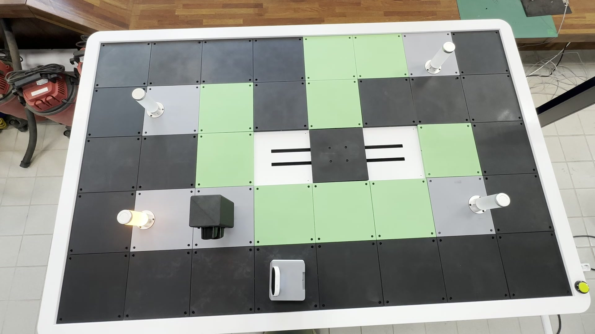
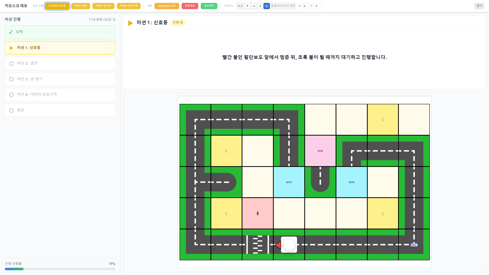
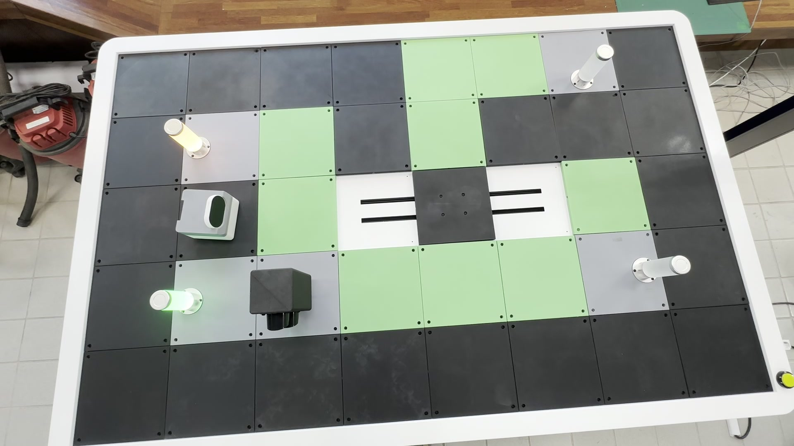
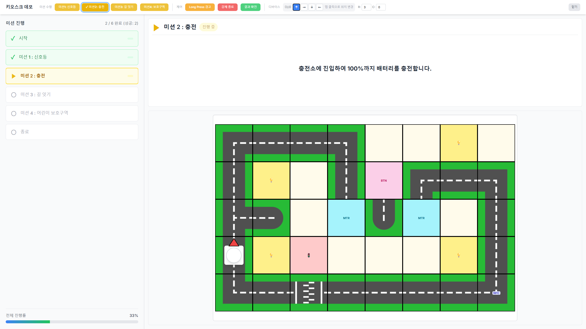
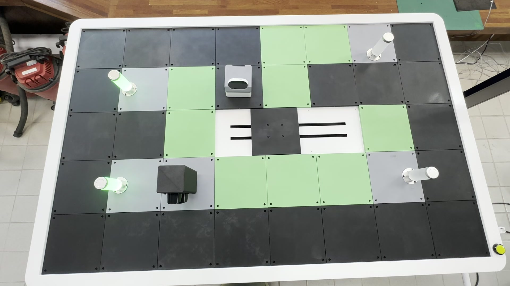
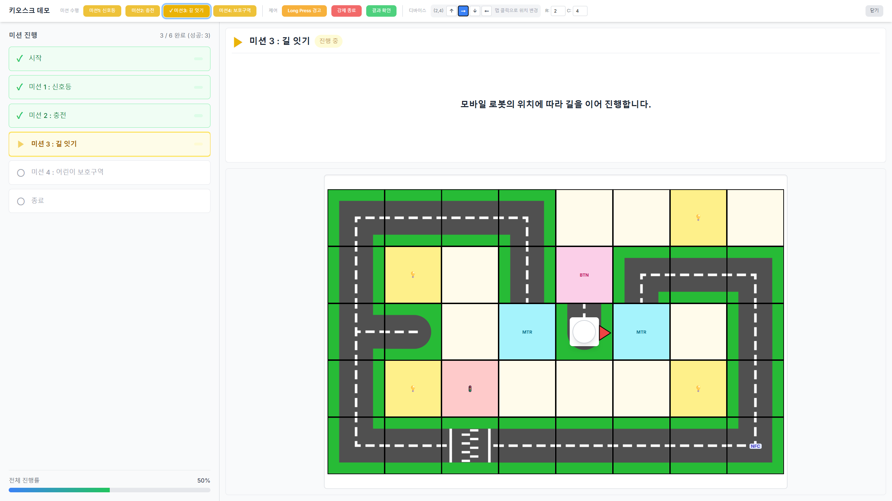
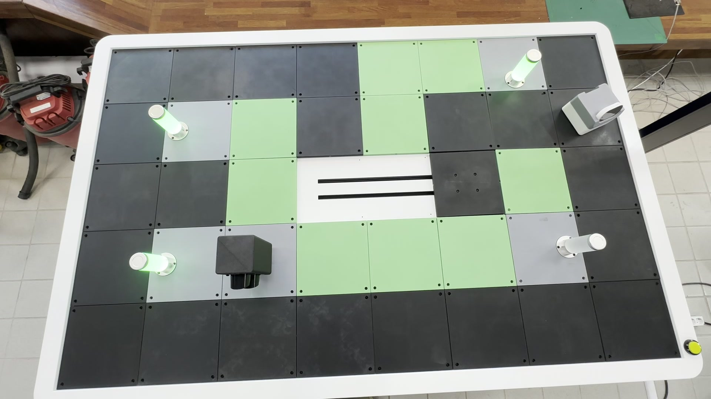
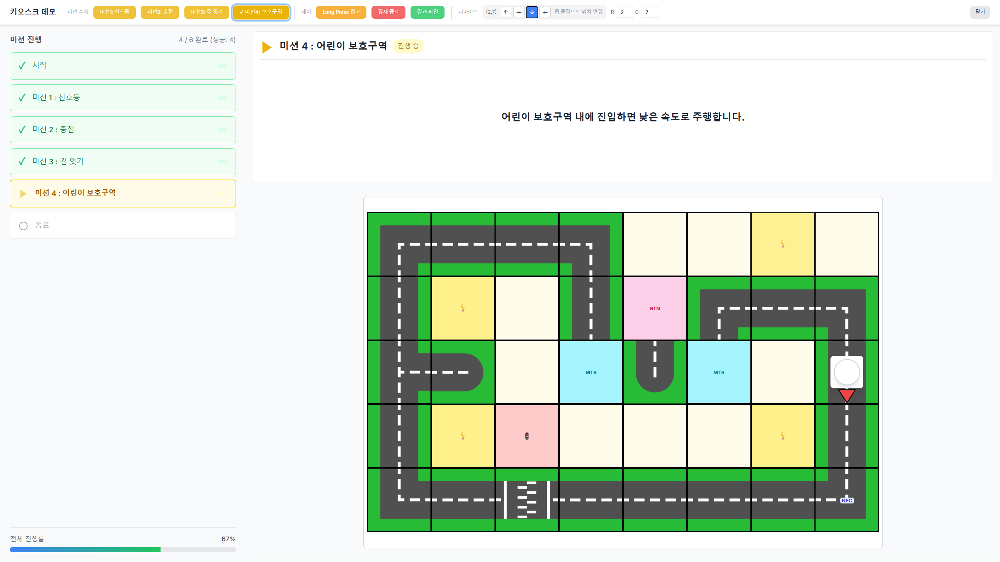

# 미션 안내 & 블록코딩 사용법

스마트 시티에는 총 **4개의 미션**이 있습니다. 미션은 순서대로 진행되며, 각 미션을 성공적으로 완료해야 다음 미션으로 넘어갑니다.

블록코딩은 키오스크 화면을 터치하며 진행합니다.

***

## 미션 1 : 신호등

빨간 불인 횡단보도 앞에서 멈춘 뒤, 초록 불이 될 때까지 대기하고 진행합니다.

<figure><figcaption>
미션 1 — 실제 주행 모습 (항공샷)
</figcaption></figure> <figure><figcaption>
미션 1 — 키오스크 화면
</figcaption></figure>

***

## 미션 2 : 충전

충전소에 진입하여 100%까지 배터리를 충전합니다.

<figure><figcaption>
미션 2 — 실제 주행 모습 (항공샷)
</figcaption></figure> <figure><figcaption>
미션 2 — 키오스크 화면
</figcaption></figure>

***

## 미션 3 : 길 잇기

모바일 로봇의 위치에 따라 길을 이어 진행합니다.

<figure><figcaption>
미션 3 — 실제 주행 모습 (항공샷)
</figcaption></figure> <figure><figcaption>
미션 3 — 키오스크 화면
</figcaption></figure>

***

## 미션 4 : 어린이 보호구역

어린이 보호구역 내에 진입하면 낮은 속도로 주행합니다.

<figure><figcaption>
미션 4 — 실제 주행 모습 (항공샷)
</figcaption></figure> <figure><figcaption>
미션 4 — 키오스크 화면
</figcaption></figure>

## 미션 수행 영상


