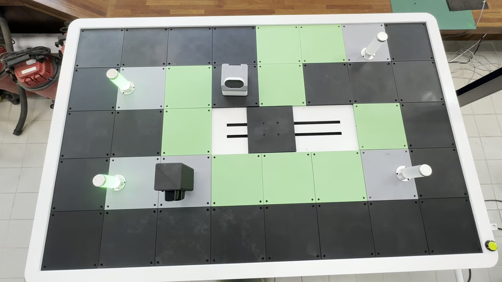

# 키오스크 앱 업데이트 방법

## 키오스크 앱 업데이트 방법

<figure><figcaption></figcaption></figure>


앱이 업데이트가 필요하면 자동으로 업데이트 팝업이 뜹니다.


* 업데이트 하기를 클릭 합니다.

<figure><figcaption></figcaption></figure>

* 설치 옵션을 선택하여 설치를 진행 합니다.

<figure><figcaption></figcaption></figure> <figure><figcaption></figcaption></figure>

* 마침을 누르면 바로 키오스크 앱이 다시 켜집니다.
