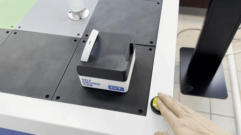

# 사용 방법

## 콘텐츠 소개

학생들이 휴닛랩에서 미션에 맞게 AI 카메라를 코딩하고, 모바일 로봇에 연결하여 스마트 시티 위에서 실행한 뒤 미션 수행 결과를 키오스크에서 단계별로 확인하는 체험형 교육 콘텐츠입니다.

***

## STEP 1 — 키오스크를 통한 블럭 코딩

키오스크 화면을 통해 각 미션에 맞게 블럭코딩을 진행합니다


블럭코딩 블럭들에 대한 설명은 다음 페이지에 있습니다.

[missions.md](missions.md "mention")


## STEP 2 — AI 카메라에 업로드

코딩이 완료된 후 HUENIT\_LAB에서 AI 카메라에 업로드 합니다.


카메라의 펌웨어 버전을 업데이트 하지 않도록 주의해야 합니. 휴닛 렙을 통하여 카메라의 펌웨어를 업데이트 하면 스마트 시티의 코드가 동작하지 않을 수 있습니다.


<figure><figcaption></figcaption></figure>

## STEP 3 — 모바일 로봇 연결

코딩이 완료된 AI 카메라를 모바일 로봇에 장착하고 연결합니다.

<figure><figcaption>
AI 카메라 장착 방법
</figcaption></figure> <figure><figcaption>
Ai 카메라가 장착된 모습
</figcaption></figure>


**주의사항**

카메라를 끼울 때 반드시 **꽉 끼워주세요.** 대부분의 문제가 카메라가 제대로 장착되지 않아서 발생합니다. 사용 후에는 카메라를 빼서 보관해 주세요.


## STEP 4 — 미션 실행

스테이션의 버튼을 눌러 시작하면 모바일 로봇이 스마트 시티 도로 위를 주행하며 미션을 수행합니다.

<figure><figcaption></figcaption></figure>

## STEP 5 — 결과 확인

미션 수행이 완료되면 키오스크 화면과 미션 렘프의 색상을 통해 결과를 확인합니다.

* <mark style="color:green;">**초록**</mark> — 미션 성공
* <mark style="color:orange;">**주황**</mark> — 미션 실행 중
* <mark style="color:red;">**빨강**</mark> — 미션 실패

<figure><figcaption>
미션 성공 시 초록색으로 점등
</figcaption></figure> <figure><figcaption>
미션 실행 중 주황색으로 깜빡
</figcaption></figure> <figure><figcaption>
미션 실패 시 빨간색으로 점등
</figcaption></figure>

## 미션 성공 영상


